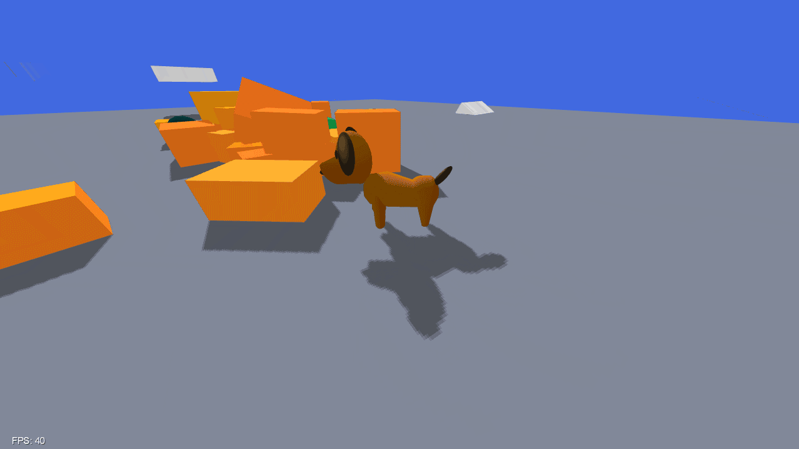
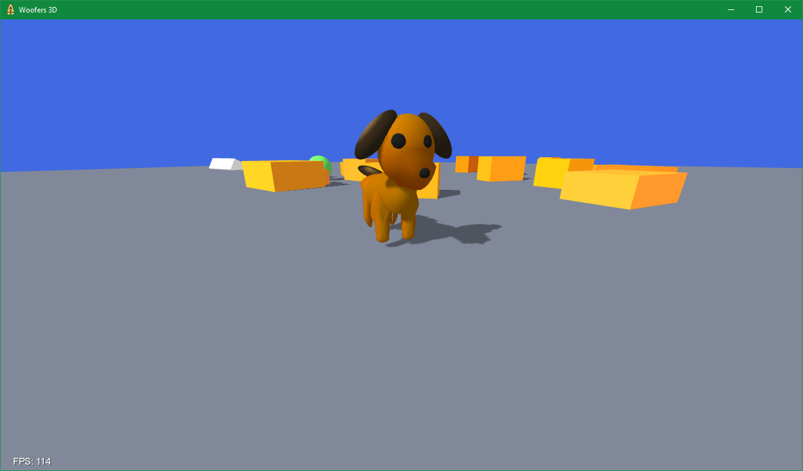
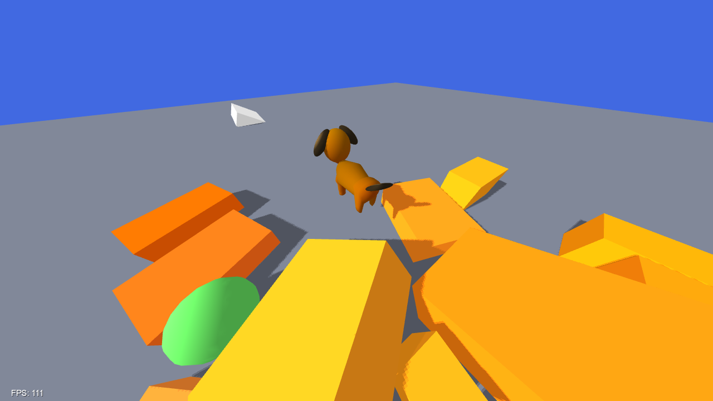
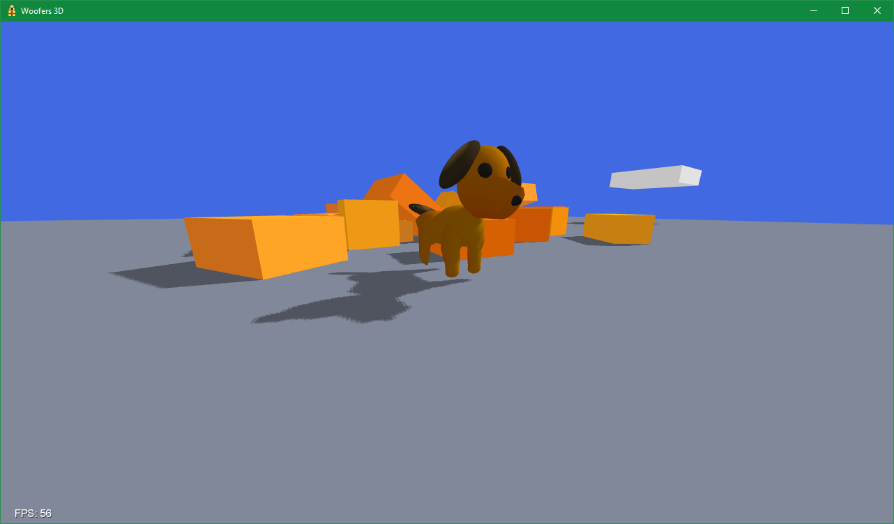

# Woofers3D

**A 3D game API designed to be effortless and simple to use.**

Supports modern features such as Ray Tracing, Chasing Camera, States and 3D Model Importing.

Built with [LibGDX](https://github.com/libgdx/libgdx), [Bullet Physics](https://github.com/bulletphysics/bullet3) and [Box2D](https://github.com/erincatto/Box2D).

## Screenshots

